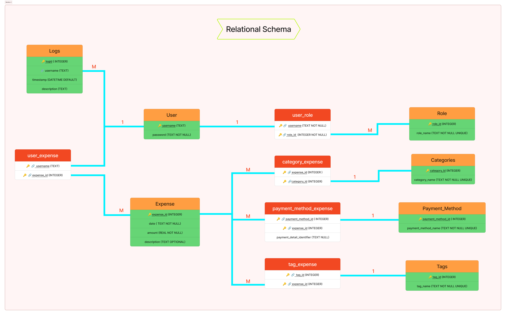

# Expensly - Expense Tracking System

<div align="center">
  
  
  <p>A comprehensive application for tracking and analyzing personal or organizational expenses</p>
  
  [](https://expensly.streamlit.app)
</div>

## 📋 Overview

Expensly is a robust expense tracking system that allows users to add, manage, and analyze expenses with multiple categories, payment methods, and tags. It features powerful reporting capabilities, CSV import/export functionality, and a role-based access control system.

## ✨ Features

### Core Features
- **User Management**: Registration, authentication, and role-based permissions
- **Expense Tracking**: Add, update, delete, and list expenses 
- **Categorization**: Organize expenses by categories and tags
- **Payment Methods**: Track expenses by different payment methods
- **Account Management**: Users and admins can manage accounts with data protection
- **Data Import/Export**: CSV file support for bulk operations

### Analytics & Reporting
- **Interactive Dashboards**: Visual representation of expense data
- **Advanced Reporting**: Multiple report types including:
  - Top N expenses
  - Category spending analysis
  - Monthly category breakdowns
  - Above-average expenses
  - Payment method usage analytics
  - Tag-based analysis
  - Customizable data visualizations

### Security & Administration
- **Role-Based Access**: Admin and User roles with appropriate permissions
- **Logs Module**: Detailed logs of user actions for security auditing
- **Data Protection**: Sensitive payment information is masked in reports

## New Features

### Security & Administration
- **Role-Based Access**: Admin and User roles with appropriate permissions
- **Logs Module**: Detailed logs of user actions for security auditing
- **Data Protection**: Sensitive payment information is masked in reports

## 🌟 Web Interface

<div align="center">
  
</div>

The modern web application built with Streamlit provides:

- **Interactive Dashboards**: Real-time data visualizations
- **User-Friendly Forms**: Intuitive data entry and management
- **Responsive Design**: Works on desktop and mobile devices
- **Role-Based Navigation**: Customized experience based on permissions
- **Real-Time Analytics**: Instant insight into your spending habits

## 🚀 Getting Started

### Prerequisites

- Python 3.6+
- Required packages (automatically installed):
  - streamlit
  - pandas
  - plotly
  - matplotlib
  - numpy

### Quick Start

**Option 1: Use the live app**
- Visit [https://expensly.streamlit.app](https://expensly.streamlit.app)

**Option 2: Run locally**

1. Clone this repository
2. Install required packages:
   ```powershell
   pip install -r requirements.txt
   ```
3. Run the Streamlit app:
   ```powershell
   streamlit run streamlit_app.py
   ```

### First-Time Usage

1. **Register an account** or use the default admin credentials:
   - Username: `admin`
   - Password: `admin`

2. **Explore the interface**:
   - Add categories and payment methods (admin)
   - Add your expenses
   - Generate reports and visualizations
   - Import/export data using CSV

## 📊 Data Management

### CSV Import/Export Format

The expected CSV format for import/export is:
```
amount,category,payment_method,date,description,tag,payment_detail_identifier
```

Example data:
```
45.99,Groceries,Credit Card,2023-05-15,Weekly shopping,food,xxxx-xxxx-xxxx-1234
120.00,Utilities,Bank Transfer,2023-05-10,Electricity bill,bills,ACH-8765432
```

### Filtering Data

Many features support powerful filtering with the following syntax:
```
<field> <operator> <value>
```

Where:
- `field`: amount, date, category, tag, payment_method, month
- `operator`: =, <, >, <=, >=
- Multiple filters can be combined with commas

Example:
```
amount > 100, category = food, month = january
```

## 👥 User Roles

### Admin
- Full system management
- User, category, and payment method administration
- Access to system-wide reports and logs

### User
- Manage personal expenses
- Generate personal reports
- Use existing categories and payment methods

## 📱 App Sections

### Dashboard
- Summary metrics of expenses
- Interactive charts for expense analysis
- Recent expense listing

### Expense Management
- Add, edit, and delete expenses
- Filter and search expenses
- Bulk operations

### Reports
- Basic reports with interactive filters
- Advanced analytics dashboards
- Data export options

### Admin Panel
- User management
- Category & payment method configuration
- System logs and activity monitoring

## 🔧 Project Structure

```
expense-tracker/
├── expense_tracker/           # Main package
│   ├── core/                  # Core functionality
│   ├── database/              # Database operations
│   ├── static/                # Static assets
│   │   ├── img/               # Images and icons
│   │   └── templates/         # CSV templates
│   ├── utils/                 # Utility functions
│   └── web/                   # Web interface
│       ├── app.py             # Main Streamlit app
│       └── pages/             # UI pages
├── .streamlit/                # Streamlit configuration
├── streamlit_app.py           # Entry point for Streamlit Cloud
├── requirements.txt           # Dependencies
└── README.md                  # Documentation
```

## 🔍 Troubleshooting

### Common Issues

1. **Database Connection**: If you encounter database errors, check network connectivity or refresh the page.

2. **Import Failures**: Ensure your CSV matches the expected format. Check for incorrect formats or missing fields.

3. **Visualization Issues**: If charts don't display, try using a different browser or clearing your cache.

4. **Permission Errors**: Verify you're logged in with the appropriate role for the action.

### Error Messages

- "Error: Username does not exist" - Check spelling or register as a new user
- "Error: Category does not exist" - Use an existing category or add as admin
- "Error: Unauthorized command" - Login with appropriate permissions

## 🔒 Security Notes

- This is a demonstration application - do not use for highly sensitive financial data
- Payment method details are masked in reports for security
- For production use, implement additional security measures

## 📚 Technologies Used

- **Frontend**: Streamlit, Plotly, HTML/CSS
- **Backend**: Python, SQLite
- **Data Processing**: Pandas, NumPy
- **Visualization**: Matplotlib, Plotly
- **Deployment**: Streamlit Cloud

## 📝 License

This project is provided as an educational tool. Feel free to use and modify for personal or educational purposes.

## 🚀 Future Enhancements

To extend this project, consider:
- Multi-currency support
- Budget planning features
- Receipt image processing
- Mobile app integration
- Cloud synchronization

---

<div align="center">
  <p>Made with ❤️ by Database Management Team</p>
  <p>
    <a href="https://expensly.streamlit.app">Live Demo</a> • 
    <a href="https://github.com/yourusername/expense-tracker">GitHub</a>
  </p>
  <p>© 2025 Expensly</p>
</div>
│   ├── utils/                 # Utility functions
│   │   ├── __init__.py
│   │   ├── csv_operations.py
│   │   ├── logs.py
│   │   └── parser.py
│   ├── web/                   # Web interface
│   │   ├── __init__.py
│   │   ├── app.py
│   │   └── pages/             # Web interface page components
│   │       ├── __init__.py
│   │       ├── advanced_reports.py
│   │       ├── basic_reports.py
│   │       ├── category_management.py
│   │       ├── import_export.py
│   │       ├── manage_expenses.py
│   │       ├── payment_management.py
│   │       ├── system_logs.py
│   │       └── user_management.py
│   └── tests/                 # Test cases
│       └── __init__.py
├── main.py                    # CLI entry point
├── run_expense_tracker.bat    # Launcher script
├── requirements.txt           # Dependencies
├── setup.py                   # Package installer
├── README.md                  # Documentation
└── import_expenses_template.csv  # CSV template
```

## Getting Started

1. Launch the application by running the launcher script:
   ```
   run_expense_tracker.bat
   ```
   This will install dependencies if needed and open the Streamlit web interface.

2. In the web interface, use the **Sign Up** tab to create a new user account (role 'user').

3. Login with your credentials via the **Login** tab.

4. As a regular user, you can:
   - Manage your own expenses (add, edit, delete)
   - View basic and advanced analytics dashboards
   - Import/export CSV data

5. To perform administrative tasks (manage users, categories, payment methods, and view logs), sign in as the default admin:
   - Username: `admin`
   - Password: `admin`

6. Once logged in as admin, use the sidebar navigation to access User Management, Category Management, Payment Method Management, and System Logs.
   After setup, you can log out and use the system as a regular user for expense tracking and reporting.

## Troubleshooting

### Common Issues

1. **Database Errors**: If you encounter database errors, check if the SQLite database file has proper permissions.

2. **Import Failures**: Ensure your CSV file matches the expected format exactly. Check for extra spaces, missing fields, or incorrect date formats.

3. **Visualization Issues**: If charts don't display:
   - Verify matplotlib and numpy are installed
   - Try running in a different terminal that supports graphical output
   - For remote connections, ensure X11 forwarding is enabled

4. **Permission Errors**: Make sure you're logged in with the appropriate role for the command you're trying to run.

### Error Messages

- "Error: Username does not exist" - Check spelling or register a new user
- "Error: Category does not exist" - Add the category or use an existing one
- "Error: Unauthorized command" - Log in with a user that has appropriate permissions

## Security Notes

- Passwords are stored in plaintext for simplicity. In a production environment, implement proper password hashing.
- Payment method details are masked in reports and exports when they contain sensitive information.

## License

This project is provided as an educational tool. Feel free to use and modify for personal or educational purposes.

## Contributing

To extend this project, consider adding:
- Multi-currency support
- Budget planning features
- Receipt image processing
- Cloud synchronization
